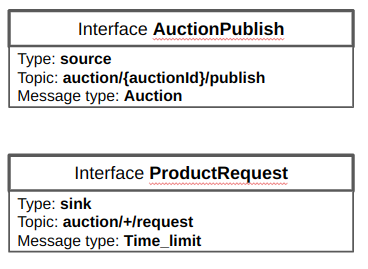
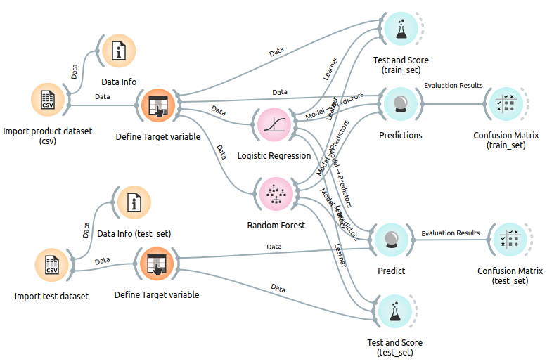

# Modelo para Apresentação do Lab03 - Coreografia e Orquestração no Brechó Online

Estrutura de pastas:

~~~
├── README.md  <- arquivo apresentando a tarefa
│
├── images     <- arquivos de imagens usadas no documento
│
└── workflows  <- arquivos de workflows
~~~

# Aluno
* `Caio Volpato`

## Tarefa 1 - Detalhando a Negociação das Ofertas

a) Representação do DTO

> Coloque a imagem PNG do diagrama do DTO, conforme exemplo a seguir:

b) Diagrama de Componentes e Descrição

> Coloque a imagem PNG do diagrama de componentes, conforme exemplo a seguir:

> Coloque a imagem PNG dos tópicos associados aos DTOs (veja exemplo a seguir). Este item é opcional, a associação pode ser feita na descrição.

> Escreva uma breve descrição de como a coreografia opera na forma de tópicos, conforme exemplo a seguir:
>
* Vendedor publica um leilão com produtos anunciados, através do componente loja.
* Cliente solicita produto, selecionando um produto desejado e uma data limite, através do componente solicitaProduto
* O componente leilão faz o "match" rankeado dos leilões publicados e produtos solicitados.

## Tarefa 2 - Recomendação de Preço

a) Workflow em Orange para recomendação

> Coloque a imagem PNG da captura de tela workflow em Orange, conforme exemplo a seguir:

> Coloque um link para o arquivo em Orange – o arquivo deverá estar na pasta workflows (veja estrutura acima). Coloque os arquivos de dados na mesma pasta. Veja exemplo a seguir:

[Workflow em Orange](workflows/orange_workflow_caio.ows)

b) Workflow em uma representação UML

> Coloque a imagem PNG da captura de tela workflow em UML, conforme exemplo a seguir:

